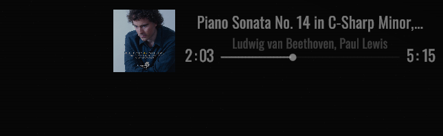

# WKMusic

A BepInEx mod for **White Knuckle** that displays your current Spotify track on the in-game HUD.




## Requirements

- Windows
- A [Spotify Developer](https://developer.spotify.com/dashboard) app with the redirect URI set to:
  ```
  https://wkmusic.eventeventeventevent1.workers.dev/callback
  ```
- Spotify Premium (required by Spotify for playback state access)

## Installation

1. Download the latest release and drop `WKMusic.dll` into:
   ```
   BepInEx/plugins/
   ```
2. Launch the game. A browser window will open automatically asking for your Spotify Client ID and Client Secret.
3. Enter your credentials, click **Connect Spotify**, and authorize in the Spotify page that follows.
4. Done. The HUD appears in the top-right corner of the screen.

Credentials and tokens are saved locally - you won't be asked again on subsequent launches.

## Getting Spotify credentials

1. Go to [developer.spotify.com/dashboard](https://developer.spotify.com/dashboard) and click **Create app**.

2. Fill in the form:
   - **App name** - anything you like, e.g. `WKMusic`
   - **App description** - can be left blank or any short text
   - **Redirect URI** - add exactly this:
     ```
     https://wkmusic.eventeventeventevent1.workers.dev/callback
     ```
   - **Which API/SDKs are you planning to use?** - check **Web API**, leave everything else unchecked

3. Click **Save**, then open the app's **Settings** page.

4. Copy your **Client ID** and **Client Secret** - you'll paste them into the setup page on first launch.

## Configuration

The config file is generated at `BepInEx/config/WKMusic.cfg` after the first launch.

| Key | Default | Description |
|---|---|---|
| `PlayerScale` | `0.8` | Overall HUD scale (0.5 – 3.0) |
| `CoverSize` | `64` | Album art size in pixels (20 – 300) |
| `CoverOpacity` | `0.6` | Album art opacity (0 = invisible, 1 = fully opaque) |
| `WorkerUrl` | *(built-in)* | Cloudflare Worker URL - change only if you self-host |

## How authorization works

The mod uses the Spotify Authorization Code flow. Your Client Secret is never sent from your machine in plain text - token exchange happens through a Cloudflare Worker that acts as a secure proxy.

```
[Game]  opens browser -> accounts.spotify.com
[Browser]  user authorizes -> returns code to Worker callback
[Worker]  exchanges code for tokens using Client Secret
[Game]  receives tokens, stores them in Windows Credential Manager
[Game]  polls Spotify API directly every 300 ms
```

## Self-hosting the Worker

> **This is completely optional.** The mod ships with a built-in public Worker - you don't need to do any of this. Self-hosting is only useful if you want full control over the OAuth proxy (e.g. for privacy reasons or if the public Worker goes down).

The Worker source is in the `worker/` directory. Deploy with [Wrangler](https://developers.cloudflare.com/workers/wrangler/):

```bash
cd worker
npm install -g wrangler
wrangler login
wrangler secret put SPOTIFY_CLIENT_SECRET
wrangler deploy
```

After deploying, set `WorkerUrl` in `BepInEx/config/WKMusic.cfg` to your Worker's URL and update the Redirect URI in your Spotify app to match.

## License

MIT
